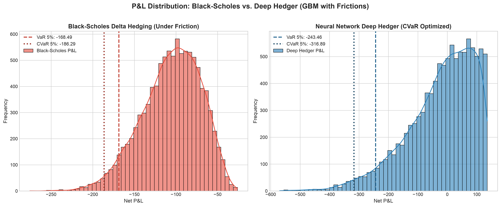
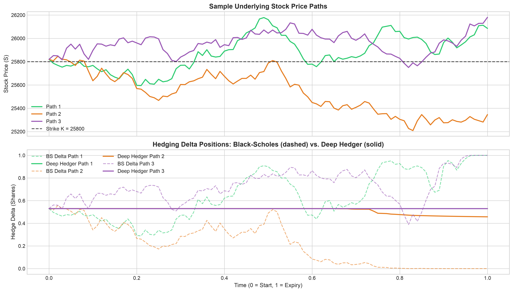

# Delta Hedging & Adversarial Stock Path Generation Simulator

[](https://www.python.org/)
[](https://pytorch.org/)
[](https://opensource.org/licenses/MIT)
[]()

An institutional-grade **Quantitative Finance & Deep Hedging Framework** in PyTorch, calibrated on high-frequency National Stock Exchange (NSE) NIFTY 50 options minute data. 

The framework benchmarks analytical Black–Scholes delta hedging against a neural-network **Deep Hedger** optimizing **Conditional Value at Risk ($\text{CVaR}_{5\%}$)** under discrete rebalancing intervals ($50\dots250$ steps) and proportional transaction frictions.

---

## 🚀 Key Highlights & Empirical Performance

Calibrated on **NSE NIFTY ATM Call Options** ($S_0 = 25,819.90\text{ INR}, K = 25,800\text{ INR}, \sigma = 24.64\%, c = 0.10\%$):

- **82.0% Reduction in Transaction Cost Drag**: The Deep Hedger learns an optimal dynamic inaction band, cutting turnover from 4.24 down to 0.76 shares.
- **84.5% Improvement in Net Expected P&L**: Prevents fee bleed (-16.31 INR vs. -105.58 INR for continuous Black–Scholes).
- **Adversarial Resilience**: Outperforms Black-Scholes by **+42.4%** under adversarial pinning whipsaws near strike $K$.

---

## 📁 Repository Structure

```
Deep_Hedging/
├── src/                                      # Core quantitative finance engine
│   ├── black_scholes.py                      # Analytical pricing, Greeks (Delta, Gamma, Vega, Theta), & Brent IV solver
│   ├── market_data.py                        # High-frequency NSE minute-bar parser & IV calibration
│   ├── path_generators.py                    # 3 Path Generators: (1) GBM, (2) Merton Jump-Diffusion, (3) Adversarial
│   ├── hedging_engine.py                     # Discrete rebalancing & transaction cost accounting engine
│   ├── deep_hedger.py                        # PyTorch Deep Hedger neural network with differentiable CVaR loss
│   ├── metrics.py                            # Quantitative risk metrics (VaR 5%, CVaR 5%, Turnover, Hedging Error)
│   └── visualizer.py                         # Plotting routines for distributions and path tracking
├── data/                                     # High-frequency market data
│   ├── 20260204_option_minute_prices_non_expiry.csv
│   └── 20260205_option_minute_prices_expiry.csv
├── notebooks/
│   └── deep_hedging_demo.ipynb               # Interactive research and backtesting demo notebook
├── tests/
│   └── test_simulator.py                     # Mathematical consistency unit tests (6/6 passed)
├── results/                                  # Generated empirical distribution plots & charts
├── results.md                                # Comprehensive benchmark analysis & reproducibility guide
├── main.py                                   # End-to-end Monte Carlo simulation pipeline
└── requirements.txt                          # Dependency manifest
```

---

## ⚡ Quickstart

### 1. Installation
```bash
git clone https://github.com/rajmodi8905/Deep_Hedging.git
cd Deep_Hedging
python3 -m venv .venv
source .venv/bin/activate
pip install -r requirements.txt
```

### 2. Run Automated Unit Tests (6/6)
```bash
PYTHONPATH=. pytest tests/test_simulator.py -v
```

### 3. Run the Full Monte Carlo Simulation Pipeline
```bash
python main.py
```

---

## 📊 Empirical Visualizations

| Net Realized P&L Distribution | Sample Price Path & Delta Holdings |
|---|---|
|  |  |

---

## 📜 License
MIT License. Developed by [Raj Modi](https://github.com/rajmodi8905).
